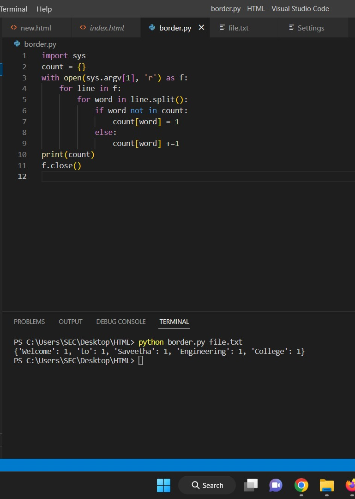

# command-line-arguments-to-count-word
## AIM:
To write a python program for getting the word count from the contents of a file using command line arguments.
## EQUIPEMENT'S REQUIRED: 
PC
Anaconda - Python 3.7
## ALGORITHM: 
### Step 1:
Import the sys module
### Step 2: 
 Import the sys module
### Step 3: 
Import the sys module
### Step 4:  
Use split() method to split the file content into words.
### Step 5: 
Use len() to find the total words.
### Step 6: 
Run the program to determine the number of words in the file created.
## PROGRAM:
```
import sys
count = {}
with open(sys.argv[1], 'r') as f:
    for line in f:
        for word in line.split():
            if word not in count:
                count[word] = 1
            else:
                count[word] +=1
print(count)
f.close()
```

### OUTPUT:


## RESULT:
Thus the program is written to find the word count from the contents of a file using command line arguments.
